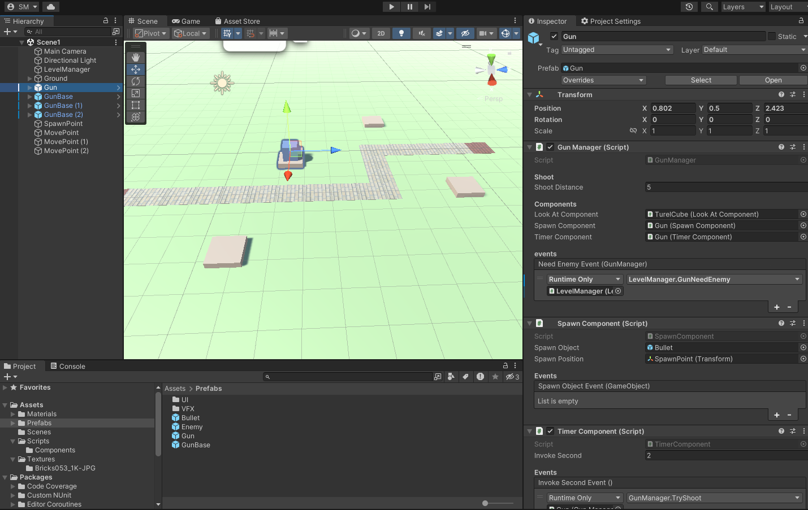
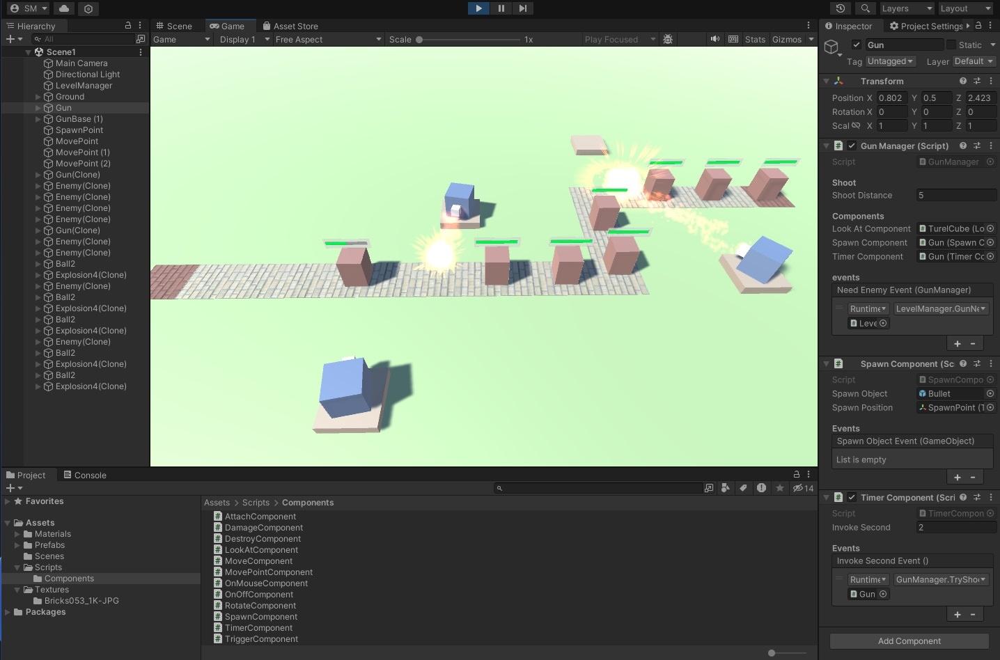

# TowerDefence

## Implemented:
1) Import scripts from Labyrinth project, create main logic with one gun and enemy
2) Create spawn enemy logic. use get-component, add logic enemy-manager, gun-manager
3) Create logic for spawn gun
4) Create logic in Enemy-Manager for program add components
5) Create logic for control collision between bullet and enemies
6) Creating Tag system to prevent the bullets interacting with each other
7) Add materials for path
8) Use physics matrix-collision with layers
9) Add visual-effects for bullet (bullet-trace, explosion)
10) Add UI for visual enemy-life with use world type-rendering

## Unity 2022

